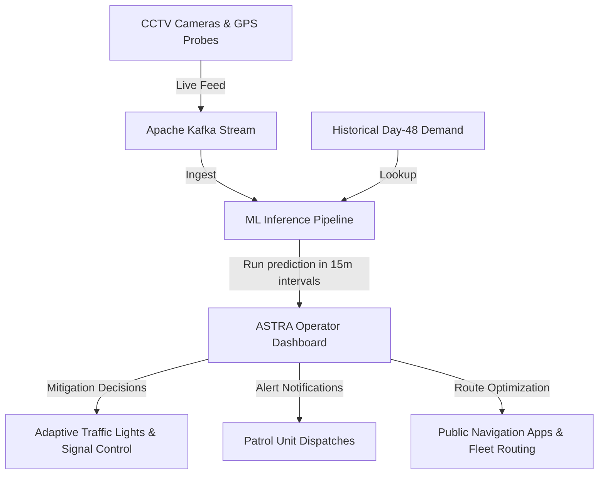

# Concept Note & Prototype Proposal: ASTRA
## Theme: Problem Statement 3 (Movement Patterns & Smart Mobility)
### Submitted by Team codealpha12

---

## 1. Introduction & Concept Overview
Urban traffic congestion is a major problem, especially in cities like Bengaluru. Problem Statement 3 asks for a solution to analyze traffic movement patterns. 

Our proposal, **ASTRA (AI Smart Traffic & Route Analytics)**, is a system that predicts traffic demand in 15-minute intervals across the city and visualizes it on an interactive dashboard. 

Although this track only requires an idea submission, we have already built and validated a fully working machine learning pipeline and a frontend dashboard prototype to prove that our proposed solution is highly practical and ready for real-world implementation.

---

## 2. Proposed Technical Framework (Backend ML)

We treat traffic demand prediction as a spatial-temporal regression problem. The goal is to forecast traffic demand (values between 0 and 1) for each geohash area on Day 49 (from 02:15 to 13:45) based on historical data.

### 2.1 Feature Engineering
To make predictions, our model processes the following features:
* **Geohash Spatial Coordinates**: We decode the 6-character geohash string into Latitude and Longitude coordinates.
* **KD-Tree Spatial Fallback**: If a geohash appears in the test set but wasn't in the training data, we use a KD-Tree nearest-neighbor search to map it to the closest known training geohash. This prevents the pipeline from crashing.
* **Cyclical Time**: Time (e.g. "13:30") is converted to sine and cosine values ($\sin(\text{time}), \cos(\text{time})$) so the model understands diurnal cycles (like 23:45 wrapping to 00:00).
* **Temporal Lags**: We use the traffic demand at the same time on Day 48, along with $\pm 15$-minute lags (`prev` and `next`), to capture temporal trends.
* **Volatility Proxy**: We compute the standard deviation of demand (`gh_std`) for each geohash on Day 48 to help the model identify volatile sectors.

### 2.2 Bayesian Overlap Shrinkage
For geohashes with sparse data, the morning overlap period (00:00 to 02:00) is highly volatile. To filter out noisy outliers, we apply a Bayesian shrinkage formula:

$$\mu_{\text{smoothed}} = \frac{\text{sum of overlap demands} + (2.0 \cdot \text{global overlap average})}{\text{count of overlap records} + 2.0}$$

This regularizes individual geohash noise and shrinks the prediction shift toward the global mean when data is sparse.

### 2.3 ML Model Ensemble
We trained an ensemble of models using 5-fold cross-validation:
* **ExtraTrees Regressor** (80% weight) — captures spatial patterns.
* **LightGBM Regressor** (20% weight) — uses gradient boosting for non-linear relationships.

This ensemble achieves a local validation R² score of **`0.96400`**.

---

## 3. Proof-of-Concept Prototype (Frontend Dashboard)

To show how traffic operators would use these predictions, we built a Single Page Application (SPA) dashboard using **HTML, CSS, and Vanilla JavaScript** (incorporating **Leaflet.js** for mapping and **Chart.js** for analytics).

### 3.1 Key Prototype Features
1. **Interactive Congestion Map**: Renders all 1,190 geohash zones on a dark map, color-coded by predicted congestion levels (Green = Free Flow, Red = Gridlock).
2. **Timeline Playback**: A timeline slider allows operators to view predictions across the day, with auto-play controls at adjustable speeds ($0.5\text{x}$ to $4\text{x}$).
3. **Zone Inspector**: Clicking any zone displays its details (lanes, road category, current weather, temperature) and renders a comparison chart of Day 48 Actual vs. Day 49 Predicted demand.
4. **Traffic Mitigation Simulation**: Operators can click on a congested zone and select a mitigation strategy (e.g. *Smart Light Control*, *Divert Heavy Vehicles*, *Patrol Dispatch*). The dashboard dynamically reduces the congestion level of that zone in-memory and updates the map overlay color in real-time.
5. **Route Delay Simulator**: Operators can draw a route on the map, and the dashboard instantly calculates the distance, number of zones crossed, average congestion, and estimated travel delay (which dynamically updates if mitigations are applied to zones along the path).

---

## 4. Real-World Practicality & Innovation
* **Proactive vs. Reactive**: ASTRA predicts congestion 30–45 minutes in advance, allowing operators to deploy patrol units or adjust signal timings *before* gridlocks occur.
* **Actionable Simulations**: By integrating the Traffic Mitigation Simulator, the dashboard functions as a decision-support tool where operators can simulate solutions and see the estimated travel delay drop.
* **Scalable Architecture**: Pre-compiling forecasts into a lightweight JSON structure allows the dashboard to load and run instantly on any web browser or tablet without needing a heavy server backend.

---

## 5. Proposed Real-World Deployment Architecture
To scale this concept note into a production system for Bengaluru, we propose the following data architecture:

This ensures ASTRA functions as a closed-loop system where data flows from sensors, through our model, and directly into city infrastructure.

