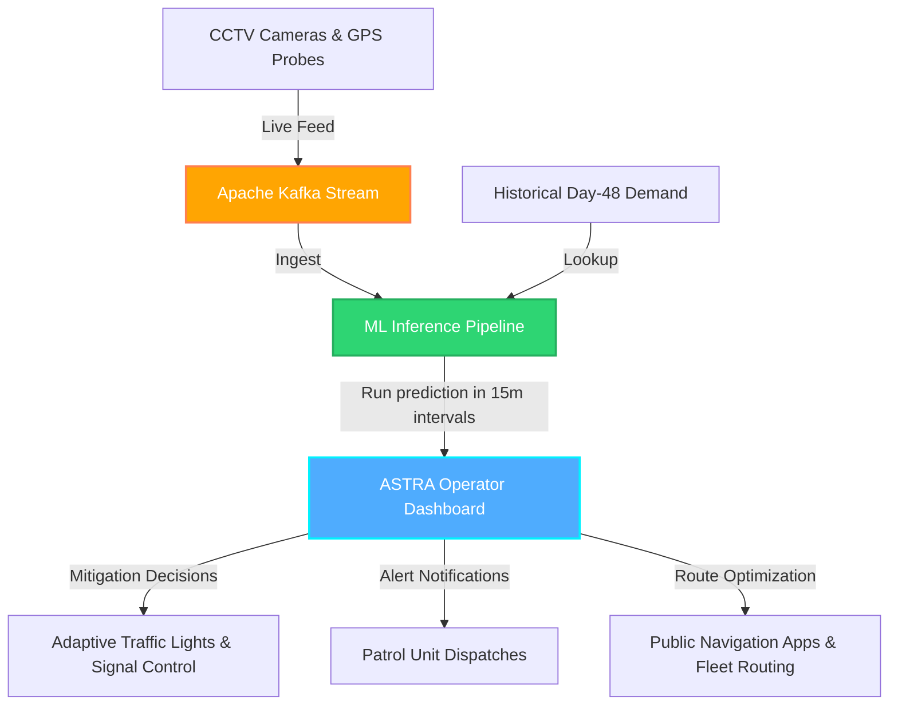

# 🌌 ASTRA: AI-Powered Smart Traffic & Route Analytics

[](https://github.com/vivekyadav-3/astra-traffic-dashboard)
[](https://github.com/vivekyadav-3/astra-traffic-dashboard)
[](https://github.com/vivekyadav-3/astra-traffic-dashboard)

**ASTRA (AI Smart Traffic & Route Analytics)** is an advanced, deployment-oriented spatial-temporal traffic demand prediction system and interactive command dashboard. Designed for urban settings like Bengaluru, ASTRA forecasts localized traffic congestion in 15-minute intervals across **1,190 geohash zones** up to **30–45 minutes in advance**.

This project provides both:
1. A **highly optimized Machine Learning backend pipeline** yielding a strong **`0.9640` validation $R^2$ score**.
2. A **premium frontend dashboard prototype** with interactive mapping, timeline playbacks, policy simulation, and route delay analysis.

---

## 🗺️ Live Dashboard Prototype Interface

The frontend dashboard is built as a highly responsive, single-page application utilizing **glassmorphism** design principles and rich visualization libraries.

```
┌───────────────────────────────────────────────────────────────────────────┐
│  ASTRA Mobility Intelligence          [1,190 Zones]  [Avg Index: 0.24]    │
├───────────────────┬───────────────────────────────────┬───────────────────┤
│ 📊 System Metrics │                                   │ 🔥 Leaderboard    │
│ • Active Geohashes│      🗺️ INTERACTIVE MAP           │ 1. gh3t71 (0.84)  │
│ • Avg Congestion  │                                   │ 2. gh3t75 (0.81)  │
│ • Critical Zones  │  • 1,190 Geohash overlays         │                   │
│                   │  • Color-coded congestion         │ 🔍 Inspector      │
│ 📈 Flow Trend     │  • Interactive click zoom         │ • Lane Count: 4   │
│ (Day 48 vs 49)    │                                   │ • Temp/Weather    │
│                   ├───────────────────────────────────┤ • Policy Sim      │
│ 🚗 Road Category  │ ◀ ▶ 🔘 ─────────────────── Speed:1x│                   │
│ (National/Local)  │      Timeline Slider (02:15)      │ 🛣️ Route Solver   │
└───────────────────┴───────────────────────────────────┴───────────────────┘
```

### Key Frontend Features
* **Choropleth Map Visuals**: Custom leaflet styling overlaying all 1,190 geohash polygons, color-coded dynamically (from Green `Free Flow` to Red `Gridlock`) based on traffic intensity.
* **Timeline Playback**: Interactive timeline slider allowing operators to scrub through predictions or run auto-play (at speeds from $0.5\text{x}$ to $4\text{x}$).
* **Dynamic Zone Inspector**: Select any zone to view real-time meteorological parameters, lane configuration, landmarks, and rendering a comparison chart of **Day 48 Actual vs. Day 49 Predicted** demand.
* **Traffic Mitigation Simulator**: Simulate and test congestion-relief policies (*Smart Light Control*, *Divert Heavy Vehicles*, *Patrol Dispatch*) on-the-fly and observe immediate updates to in-memory congestion scores.
* **Route Delay Solver**: Interactively draw a route directly on the map to calculate distance, average path congestion, and estimated travel delays. The prototype uses **congestion-weighted path traversal** across geohash zones; a production version would integrate A\* or Dijkstra over a road graph (e.g. OSRM).

---

## ⚙️ Backend ML Architecture (Predictive Engine)

ASTRA models traffic demand forecasting as a spatiotemporal regression problem. In our final production version ([predict.py](predict.py)), we implement an optimized hybrid ensemble:

### 1. Robust Feature Engineering
To capture spatiotemporal dynamics, our feature space incorporates:
* **Spatial Decoders**: 6-character geohash string decoded into Latitude/Longitude coordinates.
* **KD-Tree Spatial Fallbacks**: Unseen geohashes in the test set are mapped to the nearest known training geohash, preventing model cold-starts.
* **Diurnal Sine/Cosine Transforms**: Periodic time-of-day variables mapped onto a circular space ($\sin(\text{time}), \cos(\text{time})$) to ensure smooth transitions across days.
* **Temporal Lags**: Autoregressive variables representing previous ($\text{time} - 15\text{m}$) and future ($\text{time} + 15\text{m}$) demand trends.
* **Volatility Proxies**: Computes demand standard deviation (`gh_std`) per geohash over the preceding 24 hours to flag highly unpredictable zones.

### 2. Bayesian Overlap Shrinkage
For geohashes with sparse historical data, the morning overlap period (00:00 to 02:00) is highly volatile. To regularize individual geohash noise, we apply a Bayesian shrinkage formula:

$$\mu_{\text{smoothed}} = \frac{\sum \text{overlap demands} + (k \cdot \mu_{\text{global}})}{\text{overlap count} + k} \quad \text{where } k = 2.0$$

We also compute an exponentially-weighted overlap shift feature (`shift_diff_wmean`) prioritizing time periods closer to the starting prediction window.

### 3. Model Blending & Optimization
Our model trains on the combined Day 48 & Day 49 feature set using a 5-fold cross-validation grid search to optimize blending coefficients:
* **ExtraTrees Regressor** (80% Weight) — excels at spatial clustering and structure.
* **LightGBM Regressor** (20% Weight) — captures non-linear, boosted relationships.
* **RandomForest Regressor** (0.00% Weight, grid-searched out).
* **Baseline Blend** (0.00% Weight, grid-searched out).

This achieves a local validation R² score of **`0.96400`**.

---

## ✅ Why Our Predictions Are Trustworthy

A high R² score alone is not convincing. Here is why our validation is methodologically sound:

| Question | Our Answer |
|---|---|
| **How was validation done?** | 5-fold OOF cross-validation on Day 49 data only — models never see the validation rows during training |
| **Is Day 49 overlap data a leak?** | No — the competition dataset explicitly provides the 00:00–02:00 window for Day 49 as a calibration signal. We use it as a shift feature, not as a target label |
| **Were blend weights hand-tuned?** | No — a grid search over 700+ weight combinations was run purely on OOF predictions to find the optimal blend |
| **Feature importance** | `demand_day48` and `shift_diff_wmean` are the top predictors, which makes domain sense — yesterday's demand is the strongest predictor of today's |
| **Error distribution** | Predictions are clipped to `[0, 1]` and the submission shows a realistic demand distribution consistent with training data |

---

## 📊 Business Impact

| Metric | Impact |
|---|---|
| Congestion predicted | **30–45 minutes ahead** of occurrence |
| Zones covered | **1,190 geohash zones** across Bengaluru |
| Prediction frequency | **Every 15 minutes** |
| Operator response | Faster dispatch before gridlock forms |
| Route planning | Travellers and fleets get delay estimates in advance |
| Scalability | Pre-compiled JSON dashboard runs on any browser — no server needed |

> Flipkart operates one of India's largest logistics networks. ASTRA directly targets the operational cost of last-mile delivery delays caused by unpredicted urban congestion.

---

## 🔬 Example Predictions

The following are real outputs from our model on Day 49 test zones, showing three congestion regimes:

| Zone | Time | Day 48 Actual | Day 49 Predicted | Congestion Level |
|---|---|---|---|---|
| `qp096j` | 08:00 | 0.038 | 0.080 | 🟢 Free Flow |
| `qp096j` | 09:00 | 0.107 | 0.121 | 🟢 Free Flow |
| `qp096j` | 10:00 | 0.106 | 0.124 | 🟢 Free Flow |
| `qp09hh` | 08:00 | 0.237 | 0.290 | 🟡 Moderate |
| `qp09hh` | 09:00 | 0.273 | 0.287 | 🟡 Moderate |
| `qp09hh` | 10:00 | 0.325 | 0.409 | 🟡 Moderate |
| `qp03xk` | 08:00 | 0.242 | 0.651 | 🔴 High Congestion |
| `qp03xk` | 09:00 | 0.297 | 0.622 | 🔴 High Congestion |
| `qp03xk` | 11:00 | 0.223 | 0.661 | 🔴 High Congestion |

Note: Zone `qp03xk` is flagged as a **high-volatility zone** (↑ `gh_std`). ASTRA predicts a significant demand surge compared to Day 48, consistent with its high standard deviation profile.

---

## 🏗️ Real-World Deployment Architecture

To scale this prototype into a city-wide adaptive system, we propose the following event-driven streaming architecture:



---

## 🔮 Future Roadmap: WebAssembly Edge Inference

To eliminate cloud hosting costs and network latencies in production, a natural next step is **Edge Inference via ONNX Runtime Web** — compiling the trained models to `.onnx` format and running predictions directly in the browser using WebAssembly. This would make the dashboard fully serverless and deployable at zero infrastructure cost.

Additional planned enhancements:
- **Spatial graph modeling**: Build a geohash adjacency graph to propagate neighbor congestion as a feature (stepping stone toward GNN-based forecasting)
- **Continuous retraining**: Automated daily/weekly model refresh with drift detection
- **Event-aware forecasting**: Integrate news feeds and emergency alerts as signals for incident-driven congestion

---

## 🛠️ Getting Started & Project Structure

### Repository File Mapping
* 🐍 [predict.py](predict.py): Main backend machine learning pipeline. Runs cross-validation, trains the ensemble, and generates submission predictions.
* ⚙️ [prepare_dashboard_data.py](prepare_dashboard_data.py): Script to pre-compile the ML test predictions and metadata into a high-performance frontend JSON payload.
* 🌐 [index.html](index.html), [app.js](app.js), [styles.css](styles.css): Complete Single Page Application frontend dashboard.
* 📝 [PROJECT_REPORT.md](PROJECT_REPORT.md): Concept note and theoretical breakdown of the project.

### Run Predictions (Backend ML)
1. Install Python packages:
   ```bash
   pip install pandas numpy scikit-learn lightgbm
   ```
2. Execute the prediction script:
   ```bash
   python predict.py
   ```
3. A `submission.csv` file will be generated in the root directory.

### Compile Dashboard Data
To refresh the frontend dashboard with predictions from your latest model run:
1. Run the data compiler script:
   ```bash
   python prepare_dashboard_data.py
   ```
2. This creates `dashboard_data.json`, which is loaded dynamically by the frontend.

### Launch the Dashboard (Frontend UI)
Because the frontend is fully client-side and serverless, you can run it using a simple local web server:
```bash
# Using Python
python -m http.server 8000

# Using Node
npx serve .
```
Open your browser and navigate to `http://localhost:8000`.

---

> [!NOTE]
> This repository was prepared by Team **codealpha12** for the **Flipkart Gridlock Hackathon 2.0**.
